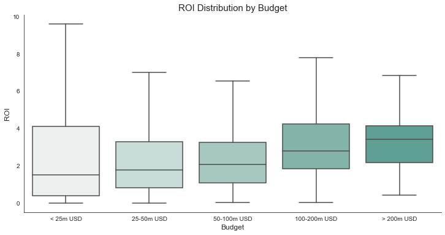
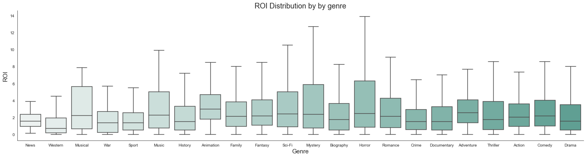
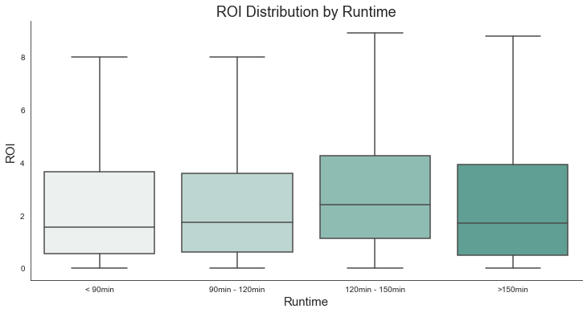
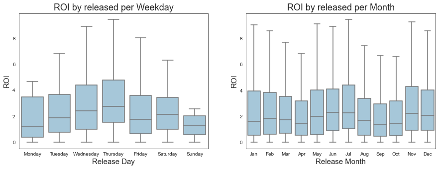
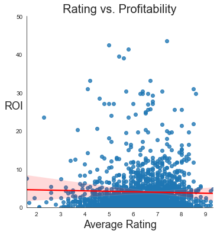

# Microsoft Movie Analysis

## Overview

This is the **first end-of-module project in the Flatiron Online Data Science Course**. The project aims at testing and reinforcing the data analysis and engineering concepts taught in phase 1 of the Flatiron School curriculum.

**Deliverables** for this project are this [GitHub Repository](https://github.com/senseize/Microsoft-Movie-Analysis), a [Jupyter Notebook](./Microsoft-Movie-Analysis-EDA.ipynb) containing the code along with markup, as well as a [presentation](./Microsoft-Movie-Analysis-Presentation.pdf).

## Business Problem

Microsoft decides to enter the movie industry and join a group of successful peers such as Amazon Prime, Netflix, Disney+, HBO and Apple TV.

In order for this venture to be successful, the head of Microsoft's new movie studio requires **data-driven, actionable insights on what type of movies to create**.

## Data

The data used was provided by Flatiron School and includes well-known movie information resources such as **IMDb, The Numbers, Rotten Tomatoes or Box Office Mojo**. After careful evaluation of the data provided, I opted for data containing information on **production budgets**, **worldwide gross figures**, **ratings**, **genres** and **runtime**. Throughout the analysis I have taken **movies produced between 1990 and 2021** into consideration, granting more than three decades worth of information.

## Methods

This project focuses on **exploratory data analysis (EDA)** methods, beginning with uploading the necessary data into the Jupyter Notebook. After careful analysis and cleaning of the data (e.g. taking care of NaN values, formatting issues or misleading column titles), the DataFrames created were merged when meaningful results were to be expected.

Since my **main focus** in the analyses was **profitability**, I applied a **Return on Profitability** (i.e. *Bang-for-Buck*) calculation. 

## Results / Key findings

**Production Budget**
 - Most movies operate on a production budget below 25m USD
 - The highest median ROI is achieved for production budgets above 200m USD
 

**Genre**
 - The most frequently produced genres are not necessarily the most profitable in terms of ROI
 - Animation, Horror and Adventure movies are most profitable
 - Western, War and Sport genres are least profitable
 

**Runtime**

 - Most movies run between 90 and 120 minutes
 - The movies with the highest median return on profitability run between 120 and 150 minutes
 - Profitability is diminishing for movies with a runtime beyond 150 minutes
 

**Release**
 - The most successful movies are release in June/July and on Wednesdays/Thursdays
 - April and September are the least profitable months for movies releases, Mondays and Sundays the least profitable weekdays
 

**Rating**
 - Ratings might be too subjective to be taken into consideration for creating financially successful movies
 - There is a negative correlation between ROI and average rating
 

## Conclusions & Actionable Insights

 1. **Higher production budget** (i.e. above 100m USD) implies **higher profitability**
 2. Releases should occur in summer months of **June/July** and mid-week days **Wednesday/Thursday**
 3. Focus on **Animation, Adventure and Horror** movies
 4. Aim for a runtime between **120-150 minutes**
 5. Ratings should be taken into consideration with caution (*subjective* and *negatively correlated with profitability*)

## Contact Information

For any questions, please contact me at **kontakt@oliverzimmer.eu**
